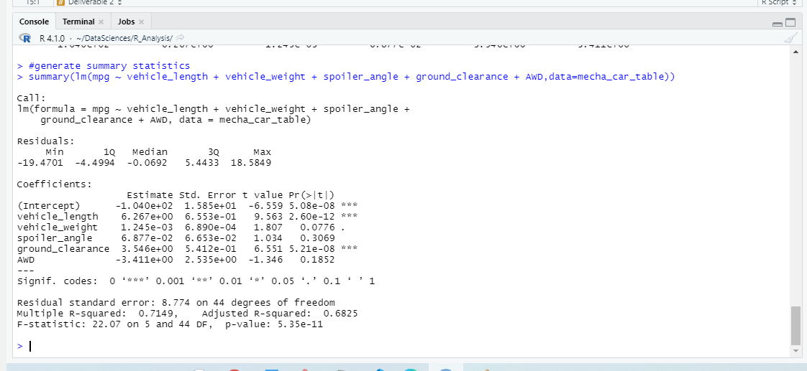
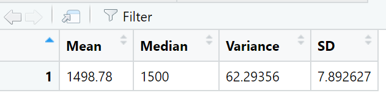
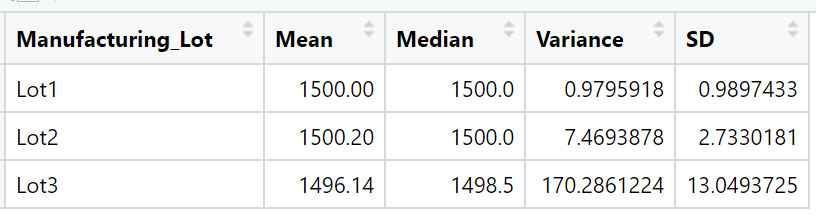
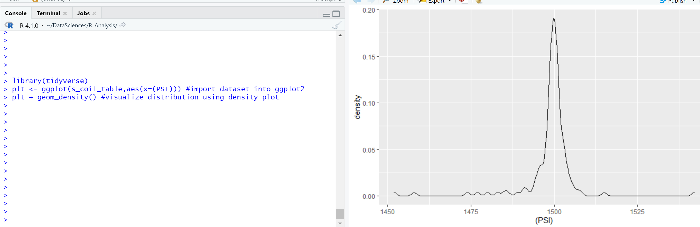
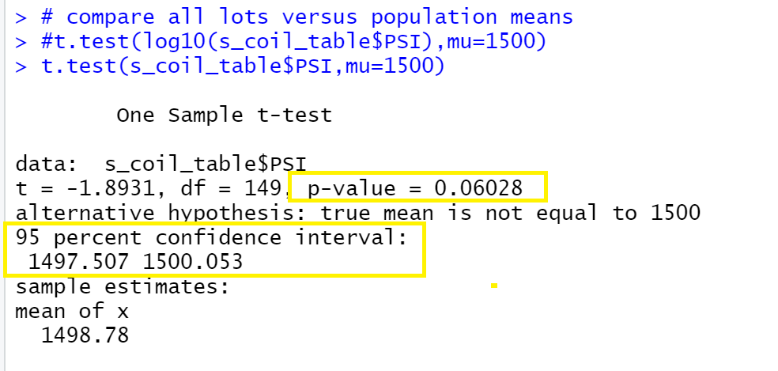
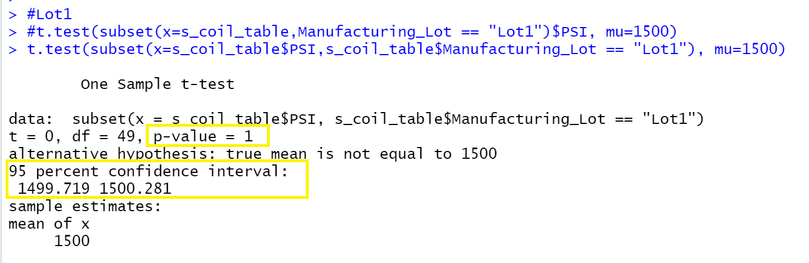
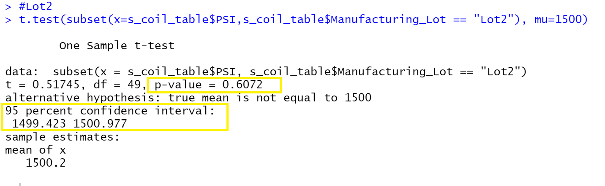
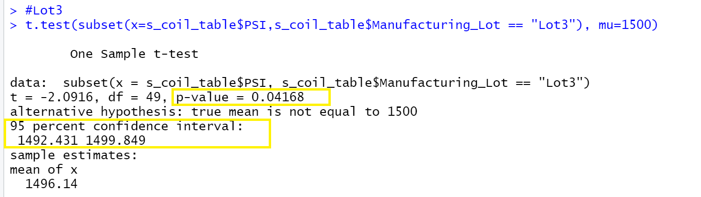

# MechaCar_Statistical_Analysis

 

## Resources:
- MechaCarChallenge.r: R File that contains code
- "resources" folder: contains all images
- Data Files:
    - MechaCar_mpg.csv
    - Suspension_Coil.csv

  

## Linear Regression to Predict MPG
To find the contribution of each variable to the linear regression model, we will need to look at individual p-values:

  

   

Establishing our significance level at 0.05, we can infer that:
  
1) Vehicle length and ground clearance have low p-value which means they provide a non-random amount of variance to the mpg values. In other words, they have a significant impact over mpg.

2) In addition, the p-value of our linear regression analysis is 5.35e-11, which is much smaller than our assumed significance level of 0.05. Hence, we can state that there is sufficient evidence to reject null hypothesis (that the slope = zero). Slope of the linear regression model is NOT zero.

3) In order to determine how effective this linear model is to approximate mpg of MechaCar prototype, we will look at r-squared (r2) value. In this case, our R-squared value is 0.7149, which means there is a strong positive correlation between the variables.

 

## Summary Statistics on Suspension Coils
In this deliverable, the objective is to determine if the manufacturing process meets weight capability design requirments which states that the variance of suspension coil must not exceed 100 PSI. This is a two part analysis where we will compute summary across all lots and then for each individual lot.

  
Total Summary:
 

  
  
  
Lot Summary:
 

  
  

- Looking at the screenshot above, we can conclude that manufacturing process meets variance requirements for overall lots, lot1 and lot2. 
- Lot3 variance is 170 which is above the threshold.

So the manufacturing process is not consistent across all lots with Lot3 not meeting the design specifications. We will look into it further when comparing population mean to individual lots in deliverable 3.

 

## T-Tests on Suspension Coils
For deliverable 3, we will determine if all manufacturing lots and individual lots are statistically different from the population mean of 1500 PSI.

In order to do so, lets state Null and Alternative hypothesis for the first part, overall manufacturing lots:
- H0 --> PSI is statistically the same as population mean of 1500 PSI (p-value > 0.05, using 0,05 significance level)
- Ha --> PSI is  statistically different from the population mean of 1500 PSI (p-value < 0.05, using 0,05  significance level)

Assuming normal distribution, we dont need to use log10 in the example.

  
PSI:
  

  
  

### Overall:
 Our p-value is above the significance level of 0.05. Plus there is 95% confidence that the mean lies between 1497 and 1500. There is not sufficient evidence to reject null hypothesis. Our Null hypothesis is correct in this case.

  

 
 

### Lot1:
 Our p-value of 1 is well above the significance level of 0.05 and there is 95% confidence that the mean lies between 1499 and 1500. Null hypothesis is correct.

  

 
 

### Lot2:
 Our p-value of 0.6072 is above the significance level and there is 95% confidence that the mean lies between 1499 and 1500. Again, not sufficient evidence to reject Null hypothesis.

  

 
 

### Lot3:
p-value of 0.04 is less the significance level and there is 95% confidence that the mean lies between 1492 and 1499. In this case we will reject our null hypothesis and state that Lot3 PSI is statistically different from population mean. 

  

 
 
 

## Study Design: MechaCar vs Competition

In order to design a statistical study to determine how MechaCar vehicles perform  compared to its competition, we need to define the parameters of the study such as:
- How many competitors are we going to include in the study?
- What kind of vehicles are we going to consider?
- What is the success criteria?
- what kind of data/variable should we consider?
- what kind of tests should we use to measure performance?

 

For this study, lets make the following assumptions regarding the questions above:
- **Competitors:**  We want to design analysis of MechaCars against one competitor at a time. Once we have created an evaluation process, it can then be repeated against any other competitor.

 

- **Vehicle Categories:** We will restrict the study to personal vehicles in broadly three categories: Sedans, SUVs, Vans.

 

- **Parameters of Performance:** Lets define success criteria as outperformance in the following categories:
    - Miles/Gallon
    - Maintenance costs (yearly)
    - Safety ratings

     

- **Data/Metrics For Testing:** we will look at the following data points for this statistical analysis:
    - Car Type
    - Year
    - MPG
    - Cylinders
    - Yearly Maintenance cost which will include:
        - oil/filter change
        - tire rotation
        - transmission fluid change
        - Coolant change
    - Safety Ratings: on a scale of 1-5, this should be based on the following features (for example):
        - Airbags
        - traction control
        - Brake assist
        - blind spot warning
        - Pedestrian detection
        - backup camera

 

- **Identify Datatypes:** it looks like we will likely deal with a combination of categorical and numerical data

 

- **Hypothesis:** define null and alternate hypothesis:
    - H0: This is no statistical difference in the performance (MPG, maintenance cost and safety ratings) of MechaCar vs competitor.
    - Ha: There is statistical difference in at least on category (MPG, maintenance cost and/or safety ratings) of performance of MechaCar vs competitor.

- **Statistical Tests:**
    - **Paired two sample t-Tests**: we will perform three of these test, one for each criteria, to determine if the mean of two samples is statistically different across all car categories:
        - MPG 
        - maintenance  cost
        - safety ratings
     - **Sample Size:** for sample size:
        - if the dataset is small, then we dont need to use a sample.
        - if the dataset is large, we can evaluate if a sample accurately represents the population by comparing sample mean with population mean using two sample t-Test.
    - **Summary Statistics:**  if we want to determine the sample that performed better, we can run summary statistics for mpg, maintenance costs and safety ratings to evaluate.
    - **Chi-Squared Test:** we can run this test to check if there is a difference in categorical frequencies between groups (such as sedan, SUV, Vans) for MechaCar and competitor data files. This way we can confirm that we are dealing with comparable data samples.
